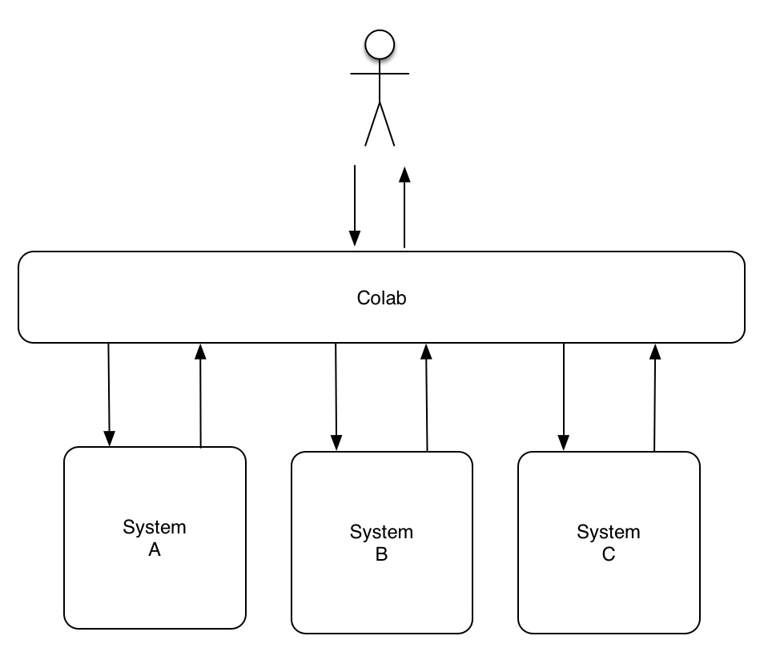

.. colab documentation master file, created by
   sphinx-quickstart on Thu Jan 22 10:59:39 2015.
   You can adapt this file completely to your liking, but it should at least
   contain the root `toctree` directive.

Colab - Integration Server for Web Applications
===============================================

Colab is an integration server  meant to help develpers to unify the **User Experience** in Web applications.

Colab provides ways to integrate:

* Authentication or Single Sign-On (SSO)
* User Interface (UI)
* Data  

To accomplish that Colab is placed in front of integrated Web applications. All user requests and responses are proxied (as in the image :ref:`image-reverse-proxy`) and therefore can have content and headers modified. Also, due to it's architecture, Colab can grant or deny access to systems under it.

.. _image-reverse-proxy:

   *Colab Reverse Proxy model*

Plugins are used in order to integrate new Web applications. Currently the following plugins are available and maintained by core developers:

* Mailman
* Gitlab
* Trac
* Jenkins

If you need to integrate a diffirent tool please refer to :ref:`plugin-dev`.

Contents:

.. toctree::
   :maxdepth: 2

   user
   plugindev
   dev

Indices and tables
==================

* :ref:`genindex`
* :ref:`modindex`
* :ref:`search`

